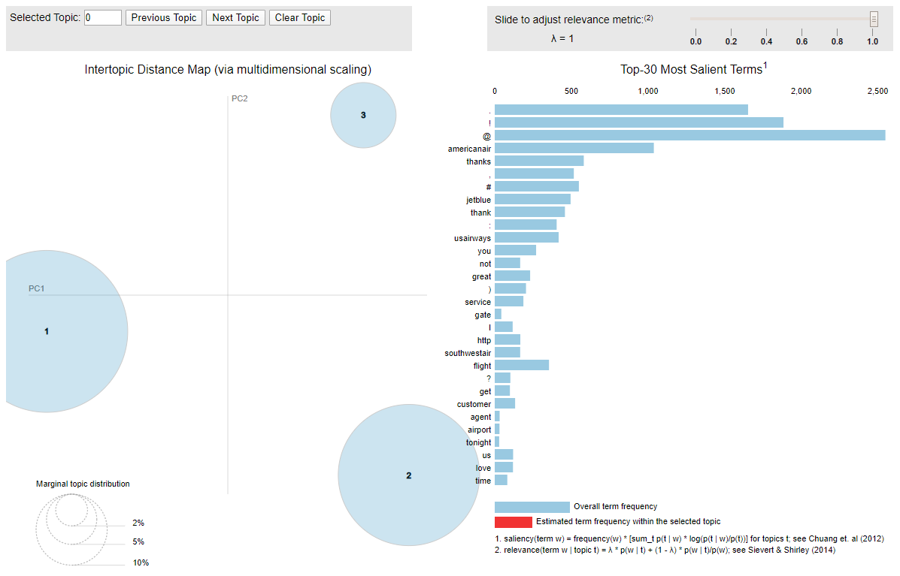
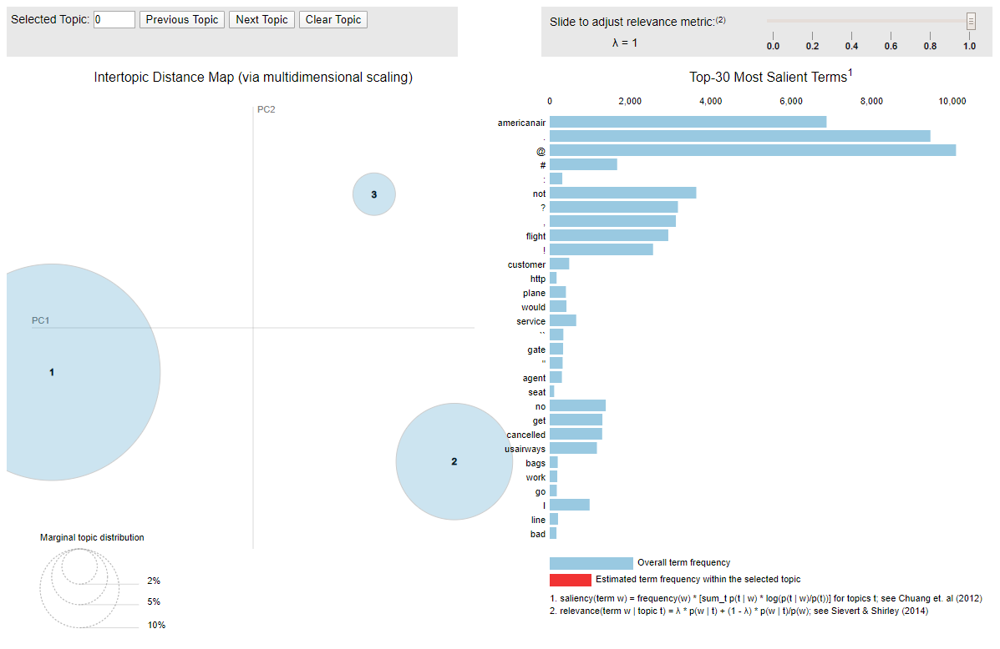

```{r setup, include=FALSE}
knitr::opts_chunk$set(echo = TRUE)
```

## Introduction
With the arrival of the internet, our lives have been changed completely. The internet is involved in some form in almost everything we do. From shopping products online to how we communicate, the internet is everywhere The internet provides varierty of platform for people who want to express their thoughts and views. There are tonnes of websites that offer expert reviews on products for consumers. The popularity of social media websites such as Twitter has also increased incredibly in last two decades. Social media are interactive computer-mediated technologies that facilitate the creation and sharing of information, ideas and expressions via virtual communities [Wikipedia]. It has given people another platform to share their feedback and communicate with other individuals and businesses. The number of social media users are huge - there are currently 7.7 billion people in the world. Roughly 46% of them are on some social media platoforms [The rise of social media]. Twitter, a social media platform that allows users to post and interact with messages known as 'tweets', had roughly 330 million daily active users in 2019 [statista].

For companies, there is a lot of information on social media, both relevant and irrelevant, that they can utilize to determine the sentiments of people towards their brand. However, the challenge is to filter out the relevant information and develop a system that can accurately analyze large amount of information to predict the sentiment.

For airline industry in particular, social media can be a great way to listen to direct consumer feedback and monitor their brand image. They are one of the largest industries in the world that serves millions of people all over the globe. The United States has the largest air travel market of any single country, with nearly 850 million people using air travel in 2017 [Statistics & Facts: Passenger airlines in the U.S.].

One of the most efficient way to determine sentiments and monitor brand image on twitter is to perform sentiment analysis using machine learning models that can predict the sentiments of the text. Sentiment analysis ia a contextual mining of text which identifies and extracts useful information from text data. It is the most common text classification tool that analyzes text data and determines whether the underlying sentiment of the text (i.e. positive/negative, happy/angry, etc.). This technique can be very useful for businesses to understand the social sentiment of their brand, product or service. The focus of this research project is to apply various sentiment analysis techniques to twitter data on US airlines.

## Hypothesis/Research Question
The goal of this research project is to apply the sentimnt analysis technique on tweets to airlines in the US. The study will explore the following research question.

* How accurately can the sentiment of tweets be predicted using various sentiment analysis techniques?
* Does supervised learning approach perform better than the lexicon models?
* What are the main topics and components that represent positive and negative sentiments?

## Data
The dataset was taken from Crowdflower website. The data consists of all tweets by twitter users in February 2015 for 6 major airlines in the US: American, Delta, Southwest, United, US Airways, and Virgin America. There are roughly 14.5k tweets and includes 15 different variables. Each tweet has a sentiment labeled to it and there are three possible sentiments: positive, neutral and negative. For negative sentiments, the data also includes reasons such as bad flight, customer service, late flight, etc.

## Methodology
The methodology for this research project consists of the following steps:

* Statistical Analysis
* Data Pre-processing
* Data modeling
* Performance Analysis
* Topics Modeling
* Results

## Statistical Analysis
We will first load all the libraries and functions that will be used in the research project. We will also load our dataset here.

### Loading libraries
```{r libaries}
##r chunk
library("reticulate")
```
 
```{python}
##python chunk
import pandas as pd
import numpy as np
import nltk
import textblob
from bs4 import BeautifulSoup
import unicodedata
import contractions
#if you want to stem
from nltk import PorterStemmer
ps = PorterStemmer()
from model_evaluation_utils import display_model_performance_metrics
```

### Loading Data

Next, we will load our dataset and get a closer look at our dataset.

```{python}
##python chunk
dataset = pd.read_csv('tweets.csv')
dataset.shape
dataset.head()
print(dataset.info())
```

```{python data preprocessing}
#select desired columns
dataset = dataset[['airline','airline_sentiment','text']]
dataset.head()
```
For the purpose of this study, we will only use two main variables: airline sentiment and tweet.

### Data Pre-processing

Next, we clean our data using a pre-defined clean_text function. The clean_text function  performs following steps on our text data:

* Remove HTML code
* Lowest case
* Remove contractions
* Replace all non-compatible characters with their equivalents

The clean_text function does not correct spelling as people tend to use lot of abbreviations while posting anything online and so that it doesnt consider words such as names.
```{python}
##python chunk
STOPWORDS = set(nltk.corpus.stopwords.words('english')) #stopwords
STOPWORDS.remove('no')
STOPWORDS.remove('but')
STOPWORDS.remove('not')

def clean_text(text):
    text = BeautifulSoup(text).get_text() #html
    text = text.lower() #lower case
    text = contractions.fix(text) #contractions
    text = unicodedata.normalize('NFKD', text).encode('ascii', 'ignore').decode('utf-8', 'ignore') #symbols
    #text = ' '.join([ps.stem(word) for word in text.split()]) #stem
    text = ' '.join(word for word in text.split() if word not in STOPWORDS) # stopwords
    return text
    
dataset['text'] = dataset['text'].apply(clean_text)
dataset.head()
```

### Data Modeling

Now, let's start developing our models. For the purpose of the study, we will build modeling using four different techniques: TextBlob, AFINN, Logistic Regression Classifier RF-IDF, Decision Tree Classifier TF-IDF and Random Forest TF-IDF. We will also look at the performance of each model. 

#### TextBlob
Before creating the model, we will first split our dataset into train and test data with 80/20  ratio. We will also calculate the polarity for all the tweets in our dataset. For polarity, We will convert from numeric to categorical with the cut off score of >0 for positive, =0 for neutral and <0 for negative.


```{python}
##python chunk
tweets = np.array(dataset['text'])
sentiments = np.array(dataset['airline_sentiment'])

from sklearn.model_selection import train_test_split

train_tweets, test_tweets, train_sentiments, test_sentiments = train_test_split(tweets, sentiments, test_size=0.20, random_state = 42)
train_tweets.shape
test_tweets.shape

#calculate sentiment for smaller example set
sentiment_polarity = [textblob.TextBlob(tweet).sentiment.polarity for tweet in test_tweets]

#convert to categorical labels
predicted_sentiments = ['positive' if score > 0 else 'neutral' if score == 0 else 'negative' for score in sentiment_polarity]

#display performance metrics
display_model_performance_metrics(true_labels=test_sentiments, predicted_labels=predicted_sentiments, 
                                  classes=['positive', 'negative', 'neutral'])
```
With TextBlob method, the model does predict all three sentiments succesfully but we only get the accuracy of 45.5% - which is very mediocre. We will run other models to check if we can get better accuracy than that.

#### AFINN

For the next model, we will use the AFINN lexicon model. It is a very popular method because of it's simplicity. Moreover, the model also considers emoticons and exclamation marks, which is great for our data as people tend to use a lot of emoticons while posting something online.
```{python}
##python chunk
from afinn import Afinn

#load the model 
afn = Afinn(emoticons=True)

#predict the polarity
sentiment_polarity = [afn.score(tweet) for tweet in test_tweets]

#convert to categorical labels
predicted_sentiments = ['positive' if score > 0 else 'neutral' if score == 0 else 'negative' for score in sentiment_polarity]

#display performance metrics
display_model_performance_metrics(true_labels=test_sentiments, predicted_labels=predicted_sentiments, 
                                  classes=['positive', 'negative', 'neutral'])
```


With AFINN, we get a slightly better accuracy of 50% - which is still not great. We will continue to try other models to see if we can get better accuracy in predicting sentiments in our data.

#### Logistic Regression Classifier TF-IDF
Next, we will try Logistic Regression Classifier with TF-IDF. Now, to train the model, we will first try logistic regression classifier. We will first create a testing and training dataset using the TF-IDF vectorizer and build TF-IDF features on training dataset. After that, we will create a blank logistic regression model, fit the model to the training data and predict the sentiment on the testing data.

```{python}
##python chunk

from sklearn.feature_extraction.text import TfidfVectorizer
train_tweets, test_tweets, train_sentiments, test_sentiments = train_test_split(tweets, sentiments, test_size=0.20, random_state = 42)
train_tweets.shape

# build TFIDF features on train tweets
tv = TfidfVectorizer(use_idf=True, min_df=0.0, max_df=1.0, ngram_range=(1,2),
                     sublinear_tf=True)
tv_train_features = tv.fit_transform(train_tweets)
tv_test_features = tv.transform(test_tweets)

from sklearn.linear_model import LogisticRegression

#blank model
lr = LogisticRegression(penalty='l2', max_iter=1000, C=1)

# fit the model
lr_tfidf_model = lr.fit(tv_train_features, train_sentiments)

# grab the predictions
lr_tfidf_predictions = lr_tfidf_model.predict(tv_test_features)

#model performance
display_model_performance_metrics(true_labels=test_sentiments,
  predicted_labels=lr_tfidf_predictions,
  classes=['positive', 'negative', 'neutral'])
```

With Logistic Regression TF-IDF, we get an accuracy of 80.19%. That's atleast a 30% gain in accuracy compared to other models we have tried so far. Next, we will try Decision Tree Classifier TF-IDF and see if we can get higher accuracy that Logistic Regression with TF-IDF.

#### Decision Tree Classifier

We will first create a blank model, fit the decision tree model in our blank model and predict the sentiments.

```{python}
##python chunk
from sklearn.tree import DecisionTreeClassifier

#blank model
dtree = DecisionTreeClassifier()

# fit the model
dtree_model = dtree.fit(tv_train_features, train_sentiments)

# grab the predictions
dtree_predictions = dtree_model.predict(tv_test_features)

#model performance
display_model_performance_metrics(true_labels=test_sentiments,
  predicted_labels=dtree_predictions,
  classes=['positive', 'negative', 'neutral'])
```

With Decision Tree, we only get an accuracy of 65.6%. For the last model, we will use Random Forest method.

#### Random Forest
For the last model, we will build a model using Random Forest method.

```{python}
##python chunk
from sklearn.ensemble import RandomForestClassifier

#blank model
rf = RandomForestClassifier(n_estimators=200)

# fit the model
rf_model = rf.fit(tv_train_features, train_sentiments)

# grab the predictions
rf_predictions =rf_model.predict(tv_test_features)

#model performance
display_model_performance_metrics(true_labels=test_sentiments,
  predicted_labels=rf_predictions,
  classes=['positive', 'negative', 'neutral'])
```

With the Random Forest, we get an accuracy of 78.3%, which is slighly below Logistic Regression method. 

### Topic Modeling
Topic modeling is a type of stastical modeling for discovering hte abstract topics that occur in the text data [towardsdatascience]. We will use Latent Dirichlet Allocation (LDA), an example of topic model, to determine what are the main components for both positive and negative reviews. 

We will first separate positive and negative reviews in our dataset and create a dictionaty and document term matrix for them to start the topics model.

#### Creating dictionary and document term matrix
```{python}
##python chunk
#load packages
import pyLDAvis
import pyLDAvis.gensim  # don't skip this
import matplotlib.pyplot as plt
import gensim
import gensim.corpora as corpora

#create separate datasets of positive and negative tweets 
positive = dataset[dataset['airline_sentiment']=="positive"]
positive_tweets = positive['text'].apply(nltk.word_tokenize)

negative = dataset[dataset['airline_sentiment']=="negative"]
negative_tweets = negative['text'].apply(nltk.word_tokenize)

#create a dictionary of the words
dictionary_positive = corpora.Dictionary(positive_tweets)
dictionary_negative = corpora.Dictionary(negative_tweets)

#create a doc term matrix
pos_doc_term_matrix = [dictionary_positive.doc2bow(doc) for doc in positive_tweets]
neg_doc_term_matrix = [dictionary_negative.doc2bow(doc) for doc in negative_tweets]
```

##### LDA Topic Model Design

Next, we will create an LDA Topic Model for the positive and negative reviews with three number of topics.

```{python}
##python chunk
#create LDA topic model for +ve dictionary
lda_model_pos = gensim.models.ldamodel.LdaModel(
  corpus = pos_doc_term_matrix, #TDM
  id2word = dictionary_positive, #Dictionary
  num_topics = 3, 
  random_state = 100,
  update_every = 1,
  chunksize = 100,
  passes = 10,
  alpha = 'auto',
  per_word_topics = True)
  
#create LDA topic model for -ve dictionary
lda_model_neg = gensim.models.ldamodel.LdaModel(
  corpus = neg_doc_term_matrix, #TDM
  id2word = dictionary_negative, #Dictionary
  num_topics = 3, 
  random_state = 100,
  update_every = 1,
  chunksize = 100,
  passes = 10,
  alpha = 'auto',
  per_word_topics = True)
```

##### Visualizing Topics

Now, we will determine the top topics for both positive and negative sentiments and visualize them.

```{python eval = FALSE}
##python chunk
#Top terms in +ve dictionary
print(lda_model_pos.print_topics())

#Top terms in -ve dictionary
print(lda_model_neg.print_topics())

vis = pyLDAvis.gensim.prepare(lda_model_pos, pos_doc_term_matrix, dictionary_positive, n_jobs = 1)
pyLDAvis.save_html(vis, 'LDA_Visualization_Positive.html')

vis = pyLDAvis.gensim.prepare(lda_model_neg, neg_doc_term_matrix, dictionary_negative, n_jobs = 1)
pyLDAvis.save_html(vis, 'LDA_Visualization_Negative.html')
```

- Positive Topics

```{r positive_topics_viz, echo=FALSE, out.width="100%", fig.align="center"}

```

For the positive topics, the visualization shows that Topic 1 contains 52% of the tokens in the dataset. It includes words like the airline names, "thank(s)", "you" which shows customers thanking airlines.
Further exploration of the topics through visualization above reveals more terms like "good", "great", "customer", "service" and "flight" suggesting that this topic is most likely related to great customer service they recieved. It also includes signs such as ":", ")" which is used for smiley emoji on twitter. This reveals that people often use smiley emoji to express their positive sentiment.

Topic 2, which contains 39.6% of the tokens, it includes words like "thanks", "made", "it", time", "help" and "appreciate" suggesting that this topic may also be related to customers appreciating and thanking airline for helping or getting to their destination on time. 

Topic 3 contains only 8.5% of the tokens, and it includes a mix of positive and neutral words like "gate", "agent", "airport", "tonight", "nice", "warm" and "seat", and traditionally negative words like "cancelled", "problems", "delay", and "reflight" . This might suggest that this topic may be related to customer experience during a problem and positive conversations with agents and other airlines staff to resolve the situation.

- Negative Topics

```{r negative_topics_viz, echo=FALSE, out.width="100%", fig.align="center"}

```

Topic 1 contains 75.3% of the tokens, and it includes words like "flight", "cancelled", "call", "help", "but", "still" suggesting that this topic may be related to cancelled flights.

Topic 2 is made up of 21.8% of the tokens, and it includes words like "customer", "service", "agent", "bad", "rude", "staff" suggesting that the topic may be realted to bad customer service . 

Finally, Topic 3, which consists a mere 2.9% of the tokens, includes words like "seat", "broken", "legroom" suggesting that this topic may be related to comfort.

### Results

In this section, we will discuss the results of our sentiment analysis. Our objective was to investigate the possibility of designing a machine learning algorithm capable of predicting sentiments from airline customers' tweets with a decent measure of precision and accurately. For the classification task, we compared the performance of five modeling methods:

Using the TF-IDF vectorizer to calculate train and test features and fitting a logistic regression model to the training data performed best for representing the polarity in the dataset. This method was able to attain accuracy, precision, recall and f1 score of 80.19%, 79.31%, 80.19% and 78.87% respectively. This is a slight improvement of 1% for all four measures for the next best performing model, the random forest classifier.


| Classifier | Accuracy (%) | Precision (%) | Recall (%) | f1 Score (%) |
|:-----------|:------------:|:-------------:|:----------:|:------------:|
| TextBlob   | 45.56        |      68.64    |    45.56   |    46.98     |
| AFINN      | 50.07        |      68.92    |    50.07   |    52.59     |
| Logistic Regression | 80.19 |    79.35    |    80.19   |    78.9     |
| Decision Tree | 64.04     |      69.14    |    64.04   |    65.80     |
| Random Forest | 78.52     |      77.69    |    78.52   |    77.68     |


## Conclusion

Social media channels have become one of the primary ways brands use to engage with their customers. Website that provide microblogging platforms to their users such as Twitter are a great utility for this purpose as they can be used as a direct line of contact with customers to reach a company's customer service desk to seek redress of issues, information and other help. Many customers also use this medium to vend their opinions on brands and products. These opinions or reviews may be either customers' compliments or their frustrations, both of which are very valuables to companies. For this reason, the unstructured data available on Twitter is a gold mine of customer feedback, which can be mined using natural language processing methods like sentiment analysis to measure these opinions and determine ways to improve brand or product performance. 

The aim of this project was to design an algorithm capable of processing the tweets of US airline customers, and classifying them according to sentiment with high precision. Of the five different algorithms tested, results showed that extracting features with the TF-IDF supervised learning approach, and fitting a model with a Logistic Regression algorithm would yield the best performing classification model by accuracy, precision, recall and f1 score. The results also showed that supervised learning approach performed better in terms of accuracy compared to the lexicon models on our dataset. 

Performing the topic modeling showed that positive sentiments include topics such as showing appreciation for good flight experience, getting to destination on time, and good customer experience during a cancelled or rescheduled flight. Meanwhile, negative sentiments include topics such as cancelled flights, bad customer service and uncomfortable flight.

## References
Crowdflower: https://www.crowdflower.com/data-for-everyone/

Wikipedia: https://en.wikipedia.org/wiki/Social_media

The rise of social media: https://ourworldindata.org/rise-of-social-media

Passenger airlines in the U.S. - Statistics & Facts: https://www.statista.com/topics/5575/passenger-airlines-in-the-us/

statista: https://www.statista.com/statistics/282087/number-of-monthly-active-twitter-users/

towardsdatascience: https://towardsdatascience.com/topic-modeling-and-latent-dirichlet-allocation-in-python-9bf156893c24

Joshi, S. (n.d.). Aspect based sentiment analysis for United States of America Airlines MSc Research Project Data Analytics.

Prabhakar, E., Santhosh, M., Krishnan, A. H., Kumar, T., & Sudhakar B B Student, R. (n.d.). Sentiment Analysis of US Airline Twitter Data using New Adaboost Approach. www.ijert.org

van de Kruis, S. (n.d.). Sentiment analysis on tweets Measuring the correctness of sentiment analysis on brand attitude.
